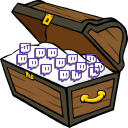
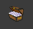
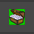

#  Twitch Treasure Collector 

- [Twitch Treasure Collector](#twitch-treasure-collector)
  - [Background](#background)
  - [What is it?](#what-is-it)
  - [The problem](#the-problem)
  - [The solution](#the-solution)
  - [Browser Extension Icon](#browser-extension-icon)
  - [Installation](#installation)
  - [Browser Support](#browser-support)
## Background

Some streamers on Twitch have enabled channel points 

## What is it?

Streamers who have enabled [channel points ](https://help.twitch.tv/s/article/channel-points-guide?language=en_US) on their channel will have something like this show below the chat window

Occasionally, so called 'click-to-claim' bonuses are offered to viewers. 

## The problem

What if you were watching, but something urgent comes up, EG, a knock on the door, your kid starts crying - you miss out on this bonuses... 

Well, not any more! 

## The solution

With TwitchTreasureCollector, you no longer need to worry about missing that bonus. As long as you have your streamers channel loaded, the extension will periodically check to see if the click-to-claim bonus icon is there, and if it is, will simulate a click.

## Browser Extension Icon

|Icon|Description|
|:-:|:-:|
||Current tab isn't Twitch!|
||You're on a Twitch channel - we'll collect those extra points for you!|

## Installation

Until the extension becomes available on the browser web stores, in the meantime, you can install the app by enabling developer mode and loading an unpacked extension.

- Firefox: [https://extensionworkshop.com/documentation/develop/temporary-installation-in-firefox/](https://extensionworkshop.com/documentation/develop/temporary-installation-in-firefox/)
- Chrome: [https://developer.chrome.com/extensions/getstarted](https://developer.chrome.com/extensions/getstarted#manifest)
- Edge [https://docs.microsoft.com/en-us/microsoft-edge/extensions-chromium/getting-started/part1-simple-extension#run-your-extension-locally-in-your-browser-while-developing-it-side-loading](https://docs.microsoft.com/en-us/microsoft-edge/extensions-chromium/getting-started/part1-simple-extension#run-your-extension-locally-in-your-browser-while-developing-it-side-loading)
  
## Browser Support

|OS|Browser|Status|
|:-:|:-:|:-:|
|Windows|Edge (Chromium) | ✔ |
|Windows| Chrome | ✔ |
|Windows| Firefox | ✔ |
|Mac OS| Safari | ⚠ |
|Mac OS| Firefox | ⚠ |
|Mac OS| Chrome | ⚠ |
|Mac OS| Edge | ⚠ |
|Linux| Firefox | ⚠ |
|Linux| Chrome | ⚠ |
|Linux| Edge | ⚠ |

| | |
|:-|:-|
|✔|Tested successfully|
|⚠|Untested|
|❌|Doesn't work / Not supported|
